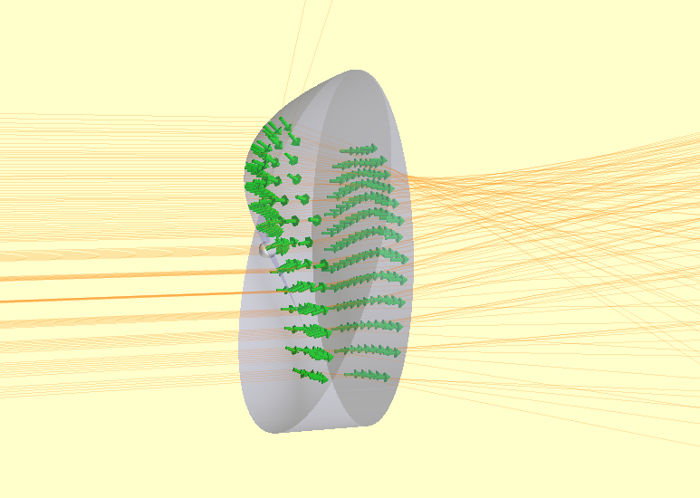

===========
Distortions
===========

The :py:mod:`raypier.distortions` module contains objects representing distortions of a given face. The Distortion objects
are intended to be used with the :py:class:`raypier.faces.DistortionFace` class (part of the General Optic framework). 
Fundamentally, any 2D function can be implemented as a Distortion. At present, on a single type is implemented. I intend 
to implement a general Zernike polynomial distortion class. Other distortion functions are easy to add.

An example of their usage:

.. literalinclude:: /../../examples/distortion_face_example.py

This example shows a high-amplitude distortion, for illustrative purposes.

During the ray-tracing operation, the intersections with distorted faces are found using an iterative algorithm similar to Newton-
Ralphson. Typically, the intersection is found with 2 to 3 calls to the intercept-method of the underlying face. Distortions
are expected to be small deviations from the underlying face (maybe no more than a few wavelengths at most). If you make the amplitude of the distortion large, the under of 
iterations to converge will increase and the ray-tracing hit take a performance hit. For very large distortions, the intercept 
my fail altogether. 

One could, in principle, wrap multiple DistortionFaces over other DistortionFaces. However, I would expect the performance penalty to be 
quite severe. In this case, A better plan would be to implement a specialised DistortionList object which can sum the distortion-values
from a list of input Distortions. On my todo list ...

In python scripting, one can simply evaluate any Distortion object given some x- and y-coordinates as numpy arrays. This is 
useful for testing. For example::

    from raypier.distortions import SimpleTestZernikeJ7
    import numpy
    
    dist = SimpleTestZernikeJ7(unit_radius=10.0, amplitude=0,1)
    
    x=y=nmupy.linspace(-10,10,500)
    X,Y = numpy.meshgrid(x,y)
    
    Z = dist.z_offset(X.ravel(),Y.ravel())
    Z.shape = X.shape #restore the 2D shape of the Z array
    
Distortions have an additional method, :py:meth:`Distortion.z_offset_and_gradient`. This returns a array of shape (N,3) 
where the input X and Y arrays have length N. The first two columns of this array contain the gradient of the 
distortion, dZ/dX and dZ/dY respectively. The third column simply contains Z. Returning both Z and it's gradient 
turns out to be useful at the C-level during tracing. I.e.::

    grad = dist.z_offset_and_gradient(X.ravel(), Y.ravel()).reshape(X.shape[0], X.shape[1],3)
    dZdX = grad[...,0]
    dZdY = grad[...,1]
    Z = grad[...,2]

Zernike Polymonial Distortions
------------------------------

More general distortions can be applied using the :py:class:`raypier.distortions.ZernikeSeries` class.

As previously, instances of this object are passed to a :py:class:`raypier.faces.DistortionFace` , along
with the base-surface to which the distortion is to be applied.

.. py:class:: ZernikeSeries(unit_radius=10.0, coefficients=[])
    :canonical: raypier.distortions.ZernikeSeries
    
    Describes a general distortion defined in terms of Zernike polynomials. 
    The ANSI single-index (J) notation is used to identify coefficients.
    
    A recursive algorithm is used for evaluation of the function with caching
    for efficient evaluation where many non-zero coefficients exist.
    
    Both the given parameters are traits on this object and updates to either 
    one will automatically update the internal state of the object (and trigger
    re-tracing of the model).
    
    :param float unit_radius: Specifies the unit-radius for the Zernike polynomials.
    :param list coefficients: A sequence of coefficient amplitudes, given a tuples (J, amplitude).
                            E.g. [(0,0.1),(2,0.3),(7,2.34)]. Any number of coefficients
                            can be specified.

    
An example of the this class in action can be seen here:

.. literalinclude:: /../../examples/zernike_distortion_example.py

.. image:: images/zernike_distortion_example.png

    
