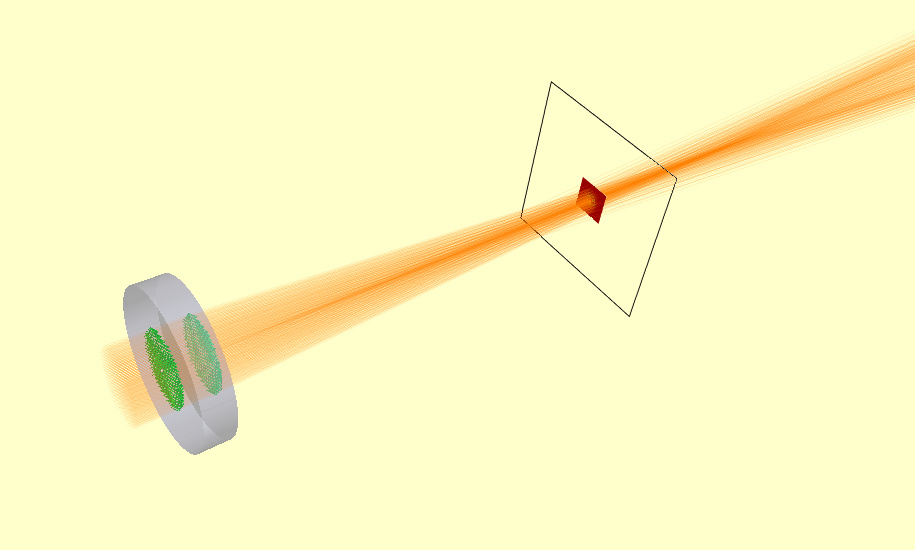
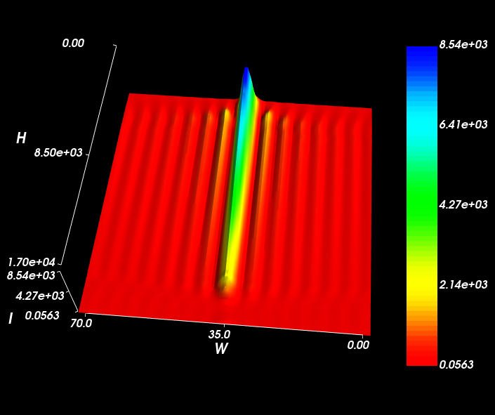

========================
Simulating a Bessel Beam
========================

A Pseudo-bessel beam can be created using an Axicon. Where the rays from opposing sides of the axicon interact, they
create a region of high intensity along the axis of the axicon. The interested properties of this beam is that it
does not diffract. Modelling this with Raypier is straightforward. We use a CollimatedGaussianBeamSource to create
the input wavefront. 

.. literalinclude:: /../../examples/bessel_beam_example.py

Here's the model view.

To get accurate results, turn up the resolution of the source object to about 30-40. Reduce the width of the EFieldPanel to ~0.1
to see the centre of the beam more clearly.

In the XY-plane, the characteristic Bessel rings are clear.

.. image:: ../images/bessel_beam_xy.png

Looking along the Z-axis (the optical axis), the constant width of the central beam is observed.

