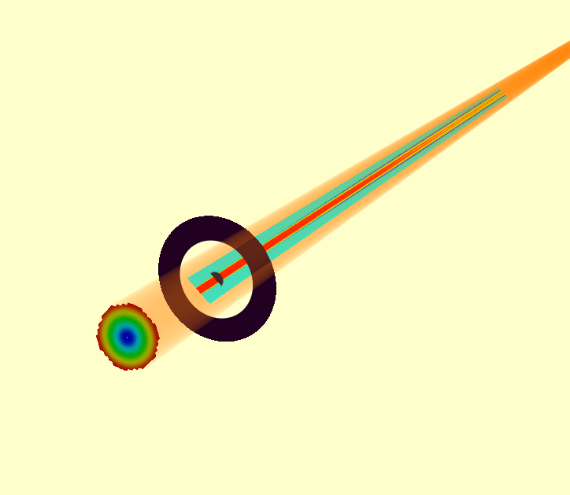
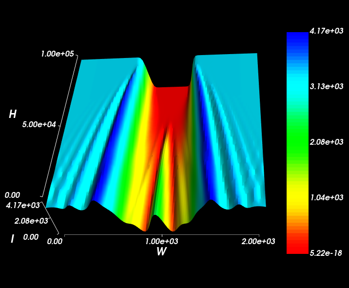
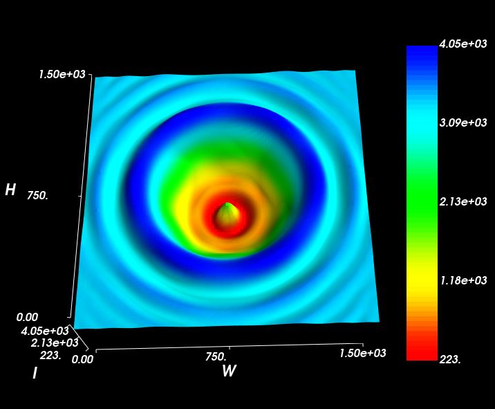

Fresnel Diffraction From A BeamStop
===================================

We simply invert an aperture to create a beam-stop. Placing this the path of a collimated beam 
created interesting Fresnel-diffraction effects, including a bright spot at the centre of the blocked path,
known as the Spot of Arago.

.. literalinclude:: /../../examples/fresnel_diffraction.py

The model looks as follows:

However, the seem the detail in the Fresnel diffraction pattern, you need lots of Gausslets. Turn up the
source resolution to at least 40.

