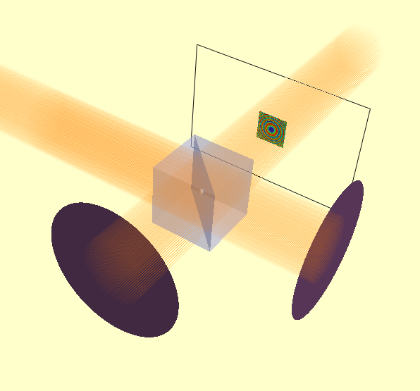
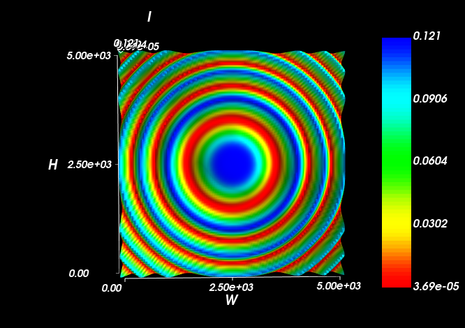

========================
Michelson Interferometer
========================

We can create a Michelson interferometer from a non-polarising beam-splitter and two mirrors. The second mirror 
has a spherical surface to generate a spherical wavefront at the detector-plane. The intensity distribution 
shows the classic Newton's Rings type pattern.

.. literalinclude:: /../../examples/michelson_interferometer_example.py

The rendered model looks as follows:

In this case, the E-field evaluation plane is large enough that we can see the intensity profile directly in the model. 
However, viewing it in a :py:class:`IntensitySurfaceView` is more convenient.

 