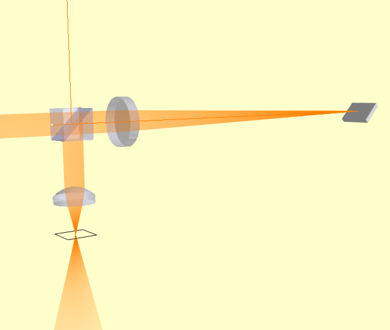
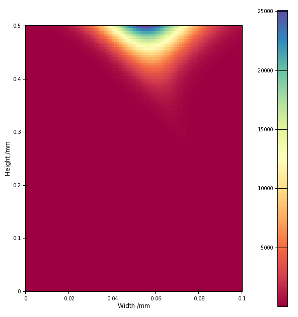

============================
Temporal Focusing Microscope
============================

Temporal focusing microscopy is an interesting variation on confocal microscopy where the 
the excitation beam is spread out not only spatially (as for confocal microscopy) but also 
temporally, by using diffraction grating to disperse a broadband laser beam. Typically, the 
method uses the exitation beam to generate 2-photon luminesence in the target which is collected
by a large-area detector. The image is formed by raster scanning the exitation focus.

This method makes a nice example of using a diffraction grating in Raypier, and a demonstration
of using a BroadbandGaussletSource to model the propagation of a femtosecond ultra-fast pulse.

In this example, we leave out the raster-scanning system (which is relatively uninteresting) so
we can focus (no pun intended) on the temporal aspect.

Here's our model:

.. literalinclude:: /../../examples/temporal_focusing_microscopy_example.py

The BroadbandGaussletSource creates a set of Gausslets with centre wavelength of 1.0 micron, and covering a total wavelength range of 0.03 micron (i.e. 30nm). Thus the wavelengths cover the range from 0.85 micron to 1.15 micron. We choose to create 200 Gausslets over this range. The E-field amplitudes of theses Gausslets has a Gaussian profile centered on the centre-wavelength. This bandwidth is set to be 13nm. The Gausslets will actually be uniformly spaced in frequency and will thus necessarily be non-uniformly spaced in terms of wavelength.

Since a single monochromatic Gausslet represents a periodic E-field amplitude (i.e. a sine-wave), a  linear combination of a finite set of such Gausslets is also periodic. It turns out our source creates a periodic pulse train where the interval between pulses is given by the inverse of the frequency-spacing of the Gausslets. If you want very widely spaced pulses, you thus need a smaller frequency-spacing and hence a larger number of rays. To keep the calculation times reasonable, it's best to use the shortest pulse-separation you can get away with to achieve your model objectives.

The 3D view of the model looks like this:

The beam is lauched on the left side of this view and is propagated through the beam-splitter cube (the reflected beam travelling upwards is discarded). The beam passes through a spherical lens with 200mm focal length. This focuses the beam onto a diffraction grating. The grating disperses the beam into its
1st order of difraction and we can see the lateral spread of the beam as it propagates back to the beam-splitter. The reflected beam from the beam-splitter passes through a aspheric objective lens and 
comes to a focus. The intersting characteristic here is that when the dispersed beams come into focus they also arrive back in phase, maximising the intensity at the focus.

The intensity profile of the beam is shown in the IntensityImageView object. The EFieldPlane object
have a `time` trait which defines the time at which the E-field is computed by advancing the phase of each wavelength accordingly. The time value of 0.0 will correspond to a pulse centered at the origin
of the source object. However, the periodic nature of the beam means that the pulse can be found at repetitions of the pulse-interval along the beam-path. We have created a 
Constraint object for this example simplify manual adjustment of the observation time-value and
for the creation of animations of a field-profile. 

Here's the animation of the pulse intensity from t=-9ps to -5ps:

The vertical axis of the image corresponds to the optical axis (the Y-axis) of the model at the object plane.  Yes, the pulse-envelop really does appear to move sideways (orthonally to the beam axis). Note, however, that the image colour scale is always "auto-scaled" which can be deceiving. 