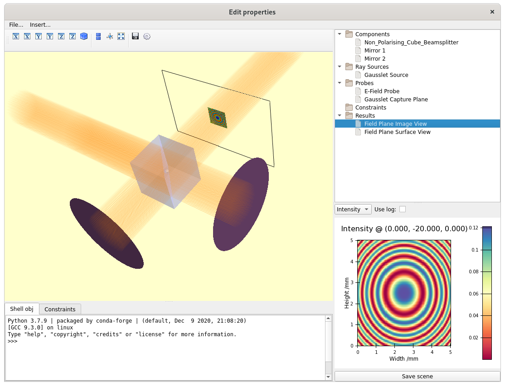
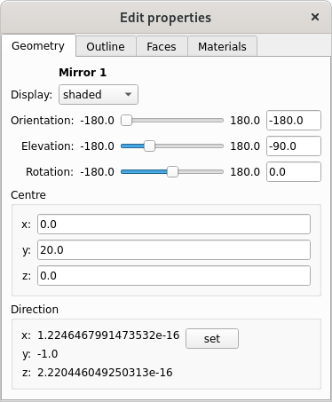

=================
Exploring the GUI
=================

Raypier is based on the Traits/TraitsUI framework. The Traits library provides a notification framework and improved type-declaration.
TraitsUI is a GUI framework that extends Traits to make developing custom GUIs fast and easy. The UI for *any* traited object
can be invoked with a call to my_object.configure_traits(). Typically, I recommend you define your base optical model in a 
script where an instance of RayTraceModel is created, then launch ui GUI with a call to the model's configure_traits() method. Lets see 
this in action. Running the michelson_interferometer_example.py script, you should see the following window

The main window is divided into 4 main regions. At the upper left, we have the main 3D model view. <left-click>-drag to rotate the view,
<middle-click>-drag to pan and <right-click>-drag to zoom. You can also zoom using the mouse-wheel.

The upper right panel shows the model tree, with sub-groups for each of the model components types. Selecting any one model component
object displays the properties-view for that object in the lower-right panel.

Double-clicking any object in the tree-view will open another properties-view window. This is useful for when you want to have the properties
of multiple objects open at once (N.B. this doesn't yet work for the *image view* and *surface view* objects. I plan to lift this
restriction later on).

For example, here's the properties view for the *Mirror 1* object:

All property windows edit their objects "live". The model will re-calculate itself automatically whenever anything changes, so you can explore 
how the ray-tracing results change as you move/adjust objects.

The bottom-left region contains two tabs: a python console and the Constraints view. There is no constraints in the example shown.

Within scope of the python terminal window, the model object is bound to the name *self*. While the rest of the model components 
can be accessed from this reference, another way to access objects is to simply drag and drop items from the tree-view into the
terminal window. These will be added to the local namespace of the terminal using either the name of the object (as given in the tree), 
or, if the name is not a valid python name (e.g. it contains spaces) it will simply be called "dragged". 

At the top of the main window there is a menu-bar with two menus. The *File...* menu lets you save/load models in YAML format. However,
I strongly advise against using this as a means of persisting models. The internals of Raypier are under active development and 
I don't give any guarantees that the YAML format is stable. I prefer to create my models as python scripts. This way, if the API
changes, one can update the code to restore the model function. Whereas, if a class-name or API changes, a YAML file will
simply refuse to load.

Model components can be added from the "Insert..." menu. The delete  or rename components, use the context-sensitive menu in the 
Tree View (<right-click> on a tree item). 