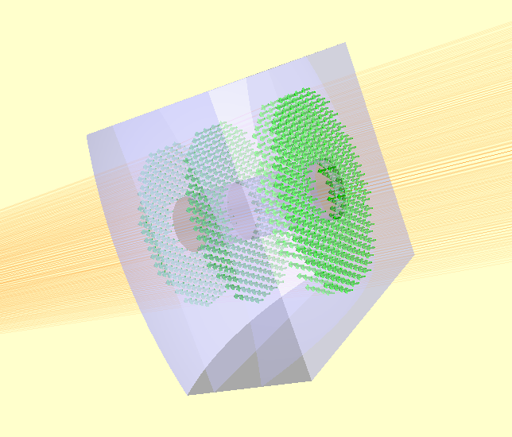

The General Optic Framework
===========================

The General Optic framework provides the most flexible means of defining optical components. The GeneralLens class
is an optic which is composed of:

* A shape (from :py:mod:`raypier.shapes`)
* A list of surfaces (from :py:mod:`raypier.faces`)
* A list of materials (from :py:mod:`raypier.materials`)

These are high-level objects which aim to streamline the process of configuring a custom optical element. The general optic
framework is appropriate for optical elements which fit the "planar" model of a outline defined in the XY-plane with a 
surface sag defined in z as a function of (x,y). Many optics are not a good fit for this description (e.g. prisms) and 
hence other sub-modules provide these components.  

Shapes
......

Shapes define the 2D outline of the optic in its local XY-plane (remember that every component has its own local 
coordinate system. The optic can have any position and orientation in the global frame of reference). 

There are two shape primitives, at the time of writing:

 * :py:class:`RectangleShape`
 
 * :py:class:`CircleShape`
 
There are two more I have yet to implement, being PolygonShape and EllipseShape.

Shapes support boolean operation so that 
they can be combined into more complex shapes. For example, to make a rectangular lens 
with a hole in it. You simply XOR a RectangleShape and a CircleShape, as follows::

  from raypier.api import CircleShape, RectangleShape
  
  my_shape = RectangleShape(width=30,height=25) ^ CircleShape(radius=3.0)
  
Likewise, shapes support AND and OR, giving you the intersection and the union of the two
shapes respectively. Internally, NOT is also available but annoyingly, the VTK boolean 
operations for implicit functions don't seem to offer a way to invert them, so I couldn't 
get the "not" visualisation to work.

Surfaces
........

The surfaces represent the geometry of the faces of the GeneralLens. While a simple singlet lens 
will have two surfaces, a doublet will have 3. In fact, any number of surfaces can be added.
 
I wanted to call the *surfaces* list of the GeneralLens "faces" but faces is already over-used as an 
attribute name.

There are 6 core face types supported by the General Optic framework:

* Planar
* Spherical
* Cylinderical
* Conic (a conic surface of revolution)
* Aspheric
* Axicon
* Distortion

These all have a "mirror" boolean trait. If this is true, the face is considered 100% reflective.
Otherwise, the reflection and transmission characteristics will be derived from the dielectric 
material coefficients on either side of the surface.

The DistortionFace object is a special type of Face that wraps another "base face" with some sort 
of geometric distortion function (for example, a Zernike polynomial function). The range of available
distortion functions can be found in the :py:mod:`raypier.distortions` module.

Materials
.........

The materials list gives the optical properties of the dielectric on either side of each surface.
For ``n`` surfaces, we need ``n-1`` materials.

Materials define their dispersion functions either as constant values, given as refractive index and absorption-coefficient,
or as functions obtained from a database of optical properties (taken from _https://refractiveindex.info/ ). In the later
case, you can specify the dielectric material by name e.g. "N-BK7".

Put all this together, here's in example::

	s1 = RectangleShape(width=30,height=25) ^ CircleShape(radius=3.0)
	
	f1 = SphericalFace(z_height=8.0, curvature=50.0)
	m1 = OpticalMaterial(from_database=False, refractive_index=1.5)
	f2 = PlanarFace(z_height=1.0)
	m2 = OpticalMaterial(from_database=False, refractive_index=1.1)
	f3 = SphericalFace(z_height=-8.0, curvature=-50.0)
	m3 = OpticalMaterial(from_database=False, refractive_index=1.6)
	f4 = PlanarFace(z_height=-9.0, invert=False)
	
	faces = [f1,f2,f3,f4]
	mats = [m1, m2, m3]
	
	lens = GeneralLens(centre=(0,0,50),
	                   shape=s1,
	                   surfaces=faces,
	                   materials=mats)
	
	src = HexagonalRayFieldSource(gauss_width=5.0,
	                              display="wires",
	                              opacity=0.1,
	                              show_normals=True)
	
	
	model = RayTraceModel(optics=[lens], sources=[src])
	
	model.configure_traits()
	
Gives us the following result:

  