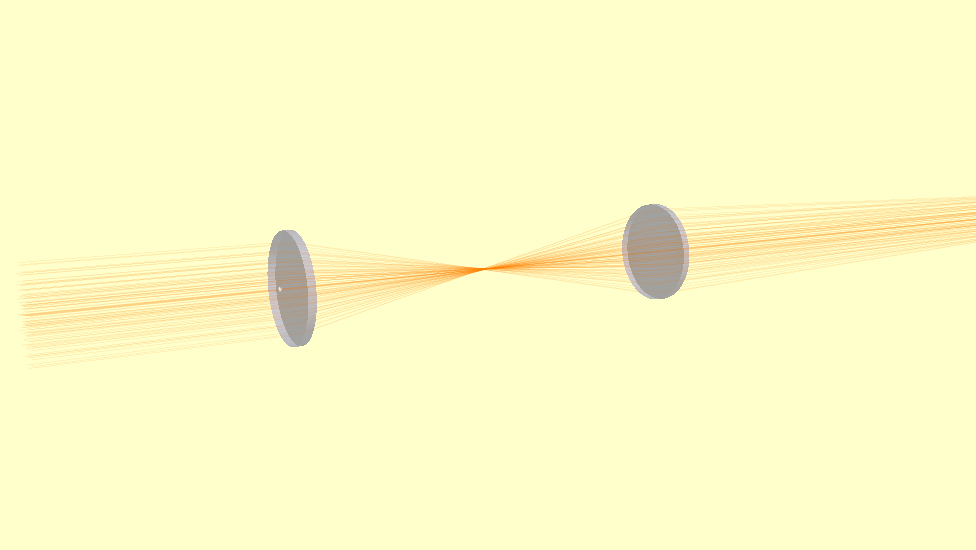
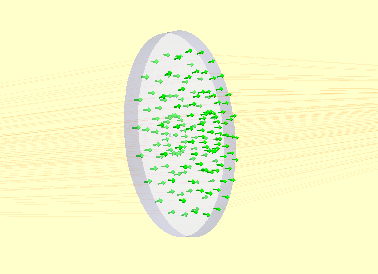

Introduction to Raypier
========================

Raypier is a non-sequential optical ray-tracing program. It is intended as a 
design tools for modelling optical systems (cameras, imaging systems, telescopes etc.).

The main features of ray-trace are:
 - Non-sequential tracing (no need to specify the order of optical components)
 - Nice visualisation of the traced result
 - Live update to the traced result as the user adjusts the model
 - Reasonable performance (tracing algorithms runs at C-speed using Cython)
 - STEP export of models for integration with CAD design (using PythonOCC)
 - Saving / Loading models in YAML format.
 - Trace rays with full polarisation and phase information
 - Physical optics propagation with "Gausslet" tracing and beam decomposition 
 - Dielectric Materials with simple-coating supported, including dispersion
 - A basic library of materials (from RefractiveIndex.info)
 - 
 - Various analysis algorithms including E-field evaluation by sum-of-Gaussian-Modes, and
   dispersion calculations for ultra-fast optics applications.

At present, the primary means of using raypier is to create your model in the
form of a python script. However, it is possible to launch an empty model and then 
add in components from the GUI / Menu.

A minimal empty model looks like::

  from raypier.api import RayTraceModel
  model = RayTraceModel()
  model.configure_traits()

This opens a GUI window from which you can add model objects using the Insert menu.

Build and Installation
======================

Installing the dependencies is probably the biggest hurdle to using Raypier. The conda
package/environment manager is far and away the easiest means of getting all the requirements
installed.

Once you have the requirements, building raypier requires a compiler. The usual process of::

    python setup.py build
    sudo python setup.py install
    
should work [no sudo if you're on Windows]. I've never tried building on a Mac.
    
If I could figure out how the heck conda-forge worked, I'd probably use it.

The Components of a Raypier Model
=================================

The RayTraceModel object is a container for the following components:

* **Optics** - these represent your optical elements like lenses, mirrors polarisers etc.

* **Sources** - these generate the input rays for the model. The sources also hold the traced rays output of the tracing operation

* **Probes** - These are objects which select or sample the tracing operation result. Probes have a 3D position and orientation. 

* **Results** - Results represent calculated quantities to be evaluated after each trace. Results do not have a 3D position.

* **Constraints** - Constraints are auxillary objects used to co-ordinate the parameters of a model for more convenient manipulation.

While all of the above objects are optional, you probably want at least one source object in your model (otherwise, the result
will be rather uninteresting). 

Basic Usage
===========

I recommend writing models as a script, then calling :py:meth:`RayTraceModel.configure_traits()` on the model to view the model in the GUI.

The basic method of model construction is to create instances of all the optical components you need, create one or more source-objects,
and whatever probes, result or constraint objects, then give them all to an instance of RayTraceModel. For example::

    from raypier.api import RayTraceModel, GeneralLens, ParallelRaySource, SphericalFace, CircleShape, OpticalMaterial

    ### Build a couple of lenses ###
    shape = CircleShape(radius=12.5)
    f1 = SphericalFace(curvature=-50.0, z_height=0.0)
    f2 = SphericalFace(curvature=50.0, z_height=5.0)
    m = OpticalMaterial(glass_name="N-BK7")
    lens1 = GeneralLens(centre=(0,0,0),
                        direction=(0,0,1),
                        shape=shape,
                        surfaces=[f1,f2],
                        materials=[m])
    lens2 = GeneralLens(centre=(0,0,100.0),
                        direction=(0,0,1),
                        shape=shape,
                        surfaces=[f1,f2],
                        materials=[m])
    
    ### Add a source ###
    src = ParallelRaySource(origin=(0,0,-50.0),
                            direction=(0,0,1),
                            rings=5,
                            show_normals=False,
                            display="wires",
                            opacity=0.1)
    
    model = RayTraceModel(optics=[lens1,lens2],
                            sources=[src])
    
    ###Now open the GUI###
    model.configure_traits()
    
Here's our model:
   

If we set `show_normals=True` on the source object, the rendering show the norma-vectors at each surface intersection. This is
a useful sanity check to be sure your model is behaving physically.

    
Retracing of the model occurs whenever any parameter changes. You can explicitly force a re-trace using the :py:meth:`RayTraceModel.trace_all`
method. I.e.::

    model.trace_all()
    
You can access the results of the trace as the :py:attr:`RayCollection.traced_rays` list on the source object. E.g.::

    for rays in src.traced_rays:
        one_ray = rays[0]
        print(one_ray.origin, one_ray.accumulated_path)
        
Sometimes, having the model re-trace on every change isn't what you want (for example, if you're doing a batch calculation,
or running an optimisation). You can block re-tracing using the :py:meth:`hold_off` context manager. I.e.::

    with model.hold_off():
        lens1.shape.radius=10.0
        src.origin=(0,0,-100.0)
        
The model should re-trace automatically on exiting the context-manager.
